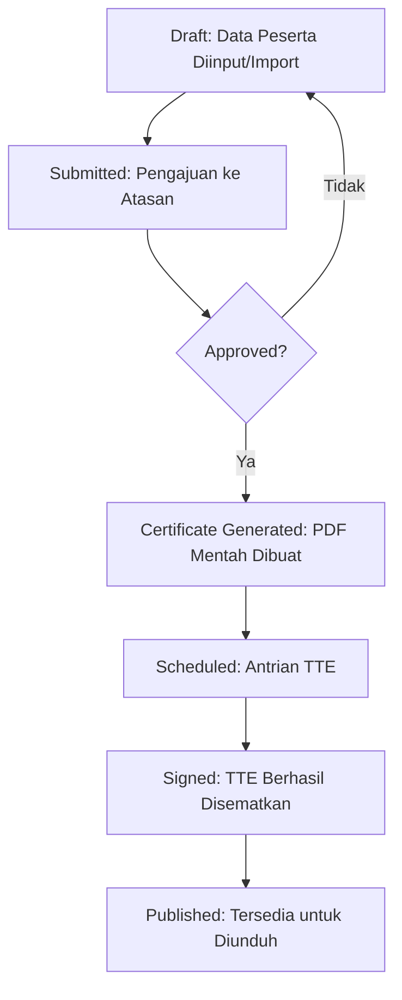

# 📑 Dokumentasi Resmi Aplikasi E-Sertifikat BPMP Kalimantan Timur

Selamat datang di dokumentasi sistem **E-Sertifikat**. Aplikasi ini dikembangkan untuk menjadi pusat pengelolaan, penerbitan, dan verifikasi sertifikat digital di lingkungan BPMP Provinsi Kalimantan Timur.

---

## 📋 Daftar Isi
1. [Ringkasan Sistem](#-ringkasan-sistem)
2. [Arsitektur & Spesifikasi](#-arsitektur--spesifikasi)
3. [Manajemen Pengguna & Akses](#-manajemen-pengguna--akses)
4. [Fitur Utama & Modul](#-fitur-utama--modul)
5. [Alur Kerja Sertifikat (Workflow)](#-alur-kerja-sertifikat-workflow)
6. [Sistem Desain Template](#-sistem-desain-template)
7. [Integrasi TTE (Digital Signature)](#-integrasi-tte-digital-signature)
8. [Pemeliharaan & Troubleshooting](#-pemeliharaan--troubleshooting)

---

## 🚀 Ringkasan Sistem

Aplikasi E-Sertifikat adalah solusi *end-to-end* yang menangani seluruh siklus hidup sertifikat. Dari pengunggahan data peserta secara massal, desain sertifikat yang dinamis, hingga penandatanganan elektronik secara hukum menggunakan API Tanda Tangan Elektronik (TTE).

### 🎯 Tujuan Utama
*   **Efisiensi:** Automasi pengisian nomor dan nama peserta ke dalam template sertifikat.
*   **Keamanan:** Menjamin keaslian sertifikat melalui verifikasi QR Code dan TTE.
*   **Aksesibilitas:** Memudahkan peserta untuk mengunduh sertifikat mereka kapan saja secara mandiri.

---

## 🛠️ Arsitektur & Spesifikasi

Sistem dibangun dengan standar industri modern untuk memastikan performa dan keamanan data.

| Komponen | Teknologi |
| :--- | :--- |
| **Framework Utama** | Laravel 12.x (PHP 8.2+) |
| **Frontend** | Tailwind CSS 4.x, Blade Engine |
| **Database** | MySQL (Produksi), SQLite (Development) |
| **PDF Engine** | DomPDF, FPDI & FPDF (untuk kustomisasi layout) |
| **Antrian (Queue)** | Laravel Queue (Redis/Database Driver) |
| **Integrasi Eksternal** | API TTE (BSrE / Pihak Ketiga) |

---

## 👥 Manajemen Pengguna & Akses

Sistem menggunakan kontrol akses berbasis peran (**Role-Based Access Control - RBAC**):

*   **Super Admin:** Akses penuh ke seluruh sistem, termasuk pengaturan sistem dan log audit.
*   **Admin Event:** Mengelola kegiatan, mengimpor peserta, dan menerbitkan sertifikat.
*   **Operator:** Melakukan verifikasi data dan membantu proses input.
*   **Verifikator (TTE):** Otoritas yang memiliki kunci untuk melakukan penandatanganan elektronik.

---

## 🏛️ Fitur Utama & Modul

### 🔵 Portal Publik (Public Area)
Area tanpa login yang dapat diakses oleh peserta:
*   **Dashboard Statistik:** Visualisasi jumlah event dan sertifikat terbit.
*   **Pencarian Mandiri:** Cari sertifikat berdasarkan NIK atau Nama Lengkap.
*   **Verifikasi Scanner:** Pemindaian QR Code untuk membuktikan keabsahan dokumen di tempat.

### 🔴 Panel Administrasi (Admin Area)
*   **Manajemen Event:** Pembuatan kategori kegiatan, durasi (JP), dan status event.
*   **Import Engine:** Pengunggahan ribuan data peserta via Excel dengan deteksi kolom dinamis.
*   **Duplicate Detector:** Pencarian otomatis data ganda berdasarkan NIK atau Email dalam satu event.
*   **Template Designer:** Pengaturan koordinat Nama, Nomor Sertifikat, dan QR Code secara visual.

---

## 🔄 Alur Kerja Sertifikat (Workflow)

Proses dari data mentah hingga menjadi sertifikat resmi mengikuti alur berikut:

### Penjelasan Status:
1.  **Draft:** Peserta terdaftar namun belum masuk proses nominasi sertifikat.
2.  **Submitted:** Memasuki tahap verifikasi admin.
3.  **Approved:** Nomor sertifikat diterbitkan secara otomatis oleh sistem.
4.  **Signed:** Dokumen PDF telah memiliki kekuatan hukum digital.

---

## 🎨 Sistem Desain Template

Sistem ini memiliki fitur unik di mana admin dapat mengunggah file gambar (JPG/PNG) sebagai background sertifikat dan menentukan posisi elemen menggunakan sistem koordinat (X, Y).

*   **Variabel Dinamis:** `[NAME]`, `[EVENT_NAME]`, `[DATE]`, `[HOURS]`.
*   **Multi-Page Support:** Mendukung sertifikat dua halaman (Depan: Identitas, Belakang: Struktur Program/Materi).
*   **QR Positioning:** QR Code verifikasi dapat diletakkan di mana saja sesuai desain.

---

## 🖊️ Integrasi TTE (Digital Signature)

Integrasi TTE dilakukan menggunakan sistem antrian guna menangani beban kerja yang besar:

1.  **Background Job:** Penandatanganan tidak dilakukan seketika (asinkron) agar user tidak menunggu loading lama.
2.  **Queue Worker:** Menjalankan perintah `php artisan queue:work` untuk memproses antrian.
3.  **Security:** Private key penandatangan dikelola secara aman melalui API Gateway.

---

## 📂 Struktur Folder Penting

*   `app/Http/Controllers/Tte`: Logika khusus integrasi tanda tangan digital.
*   `app/Models`: Menyimpan skema data (Event, Participant, Certificate).
*   `resources/views/admin`: Antarmuka pengelolaan sistem.
*   `storage/app/public/templates`: Tempat penyimpanan file desain background.
*   `storage/app/public/certificates`: Arsip sertifikat yang telah terbit.

---

## 🛠️ Pemeliharaan & Troubleshooting

### Perintah Penting (CLI):
| Tujuan | Perintah |
| :--- | :--- |
| **Menjalankan Scheduler** | `php artisan schedule:work` |
| **Memproses TTE** | `php artisan queue:work --queue=tte-signing` |
| **Reset Cache Tampilan** | `php artisan view:clear` |

### Masalah Umum (FAQ):
*   **Sertifikat tidak muncul di pencarian?** Pastikan status sertifikat sudah `Signed` dan event dalam status `Published`.
*   **Gagal Import Excel?** Periksa apakah file mengikuti format template terbaru (unduh template di menu Peserta).
*   **TTE Gagal?** Cek koneksi ke API TTE dan pastikan akun penandatangan masih aktif/valid.

---
*Dikembangkan untuk BPMP Provinsi Kalimantan Timur.*
*Versi Dokumen: 1.2 (April 2026)*
